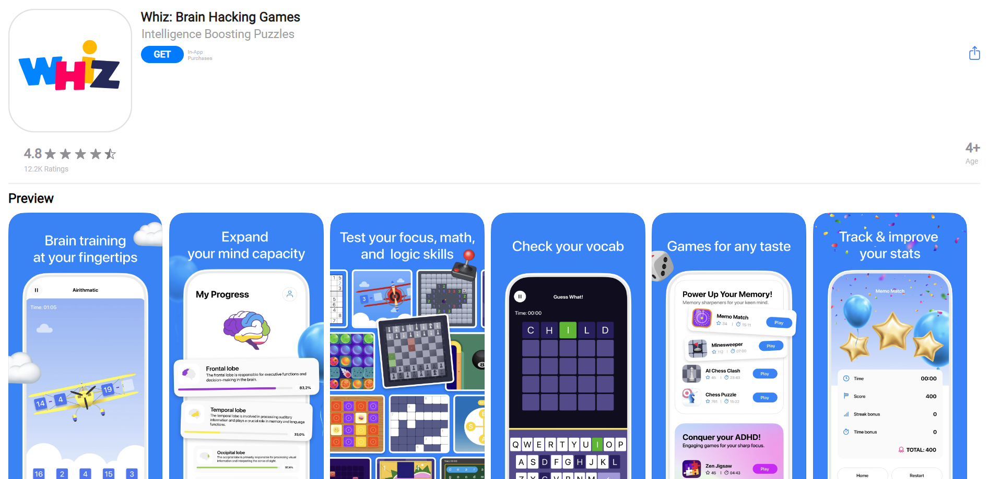
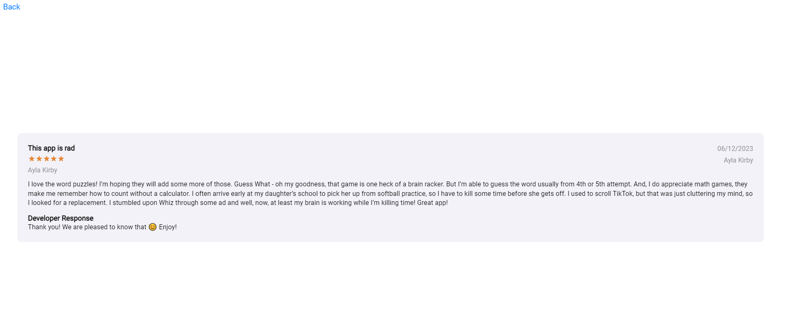

# Это репозиторий содержит HTML-страницу для веб-приложения Whiz: Brain HackingGames.

## Структура проекта:

css/style.css - стили для визуального оформления.

images/ - папка с изображениями, используемыми в приложении.

js/ - папка с JavaScript-скриптами для различных функциональностей. Зависимости:
modern-normalize - стили длянормализации стилей по умолчанию в разных браузерах.

## Верстка:

Сайт построен нао снове HTML5 с использованием стилей CSS. Имеется набор
изображений, включая логотипы, иконки и скриншоты приложения.

## Интерактивность:

Взаимодействие с элементами реализовано с использованием JavaScript. Есть
модальные окна для отображения дополнительной информации и изображений.

